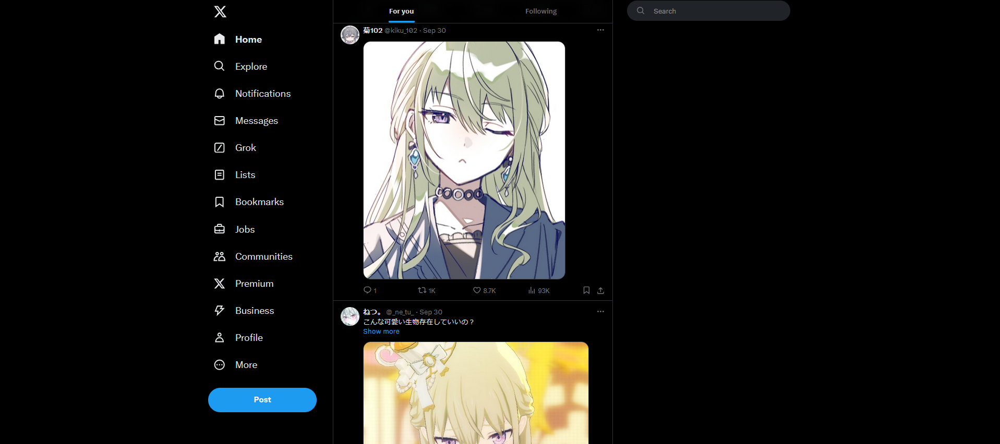
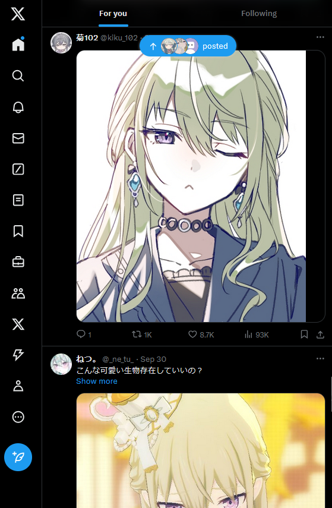
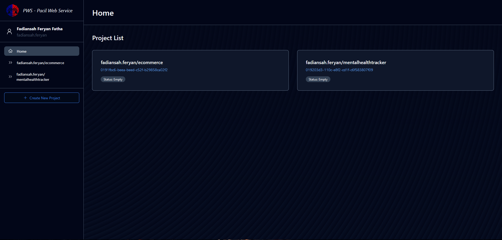
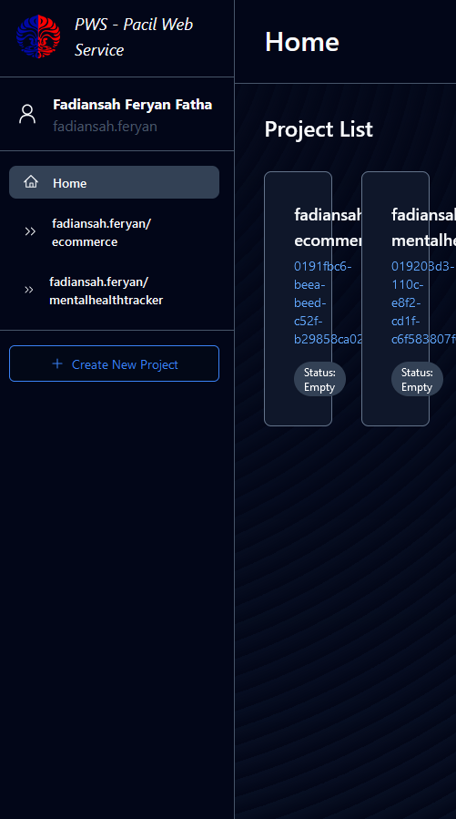
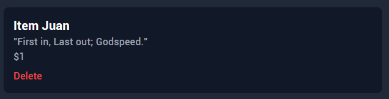
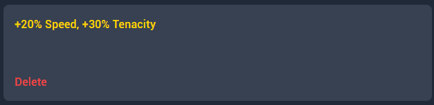

# Link deployment :

### http://fadiansah-feryan-ecommerce.pbp.cs.ui.ac.id/

<details>
<summary> <h1> Tugas 2 </h1> </summary>
<br>

# Pertanyaan 1

### Jelaskan bagaimana cara kamu mengimplementasikan checklist di atas secara step-by-step (bukan hanya sekadar mengikuti tutorial).

Saya pertama menginitialize git repo (tetapi belum disambung dengan repo di github), lalu membuat virtual environment dan menginisialisasi Django project. Saya lalu memenuhi syarat tugas 2 pada bagian - bagian yang berbeda.

# Pertanyaan 2

Buatlah bagan yang berisi request client ke web aplikasi berbasis Django beserta responnya dan jelaskan pada bagan tersebut kaitan antara urls.py, views.py, models.py, dan berkas html

[Bagan](md/images/pbpbagan.png)

# Pertanyaan 3

### Jelaskan fungsi git dalam pengembangan perangkat lunak!

Git digunakan untuk melakukan version control dan melihat apa saja yang ditambahkan pada proyek pada timestamp tertentu. Git juga bisa digunakan untuk melakukan rollback ke versi sebelumnya jika ada masalah pada prod.

# Pertanyaan 4

### Menurut Anda, dari semua framework yang ada, mengapa framework Django dijadikan permulaan pembelajaran pengembangan perangkat lunak?

Karena Django pas untuk projek kecil dan memiliki paradigma yang cukup mudah untuk dimengerti.

# Pertanyaan 5

### Mengapa model pada Django disebut sebagai ORM?

Karena model pada Django berfungsi sebagai basis data untuk apa yang akan ditunjukkan kepada end-user dengan template.

</details>

<details>
<summary> <h1> Tugas 3 </h1> </summary>
<br>

# Pertanyaan 1

### Jelaskan mengapa kita memerlukan data delivery dalam pengimplementasian sebuah platform?

_Data delivery_ sangat penting dalam implementasi platform untuk memastikan transfer informasi yang akurat dan tepat waktu antara _user_, sistem, dan _service_. Pengiriman data yang efisien juga membuat _user experience_ yang baik dengan memastikan keandalan platform. Tanpa mekanisme pengiriman data yang tepat, fungsi platform bisa terganggu, yang dapat menyebabkan disatisfaksi _user_.

# Pertanyaan 2

### Menurutmu, mana yang lebih baik antara XML dan JSON? Mengapa JSON lebih populer dibandingkan XML?

Saya pribadi lebih menyukai JSON karena dalam pandangan sekilas struktur data dapat dicerna dengan jelas. Saya rasa hal ini juga berpengaruh atas popularitasnya dibanding dengan XML.

# Pertanyaan 3

### Jelaskan fungsi dari method `is_valid()` pada form Django dan mengapa kita membutuhkan method tersebut?

method `is_valid()` dalam form Django digunakan untuk memastikan data dalam field form dapat diterima oleh model yang sudah di deklarasikan. method `is_valid()` diperlukan supaya saat data diberikan ke database tidak ada error yang terjadi.

# Pertanyaan 4

### Mengapa kita membutuhkan `csrf_token` saat membuat form di Django? Apa yang dapat terjadi jika kita tidak menambahkan `csrf_token` pada form Django? Bagaimana hal tersebut dapat dimanfaatkan oleh penyerang?

`csrf_token` pada django digunakan untuk memastikan bahwa semua request pengubahan data datang dari `user` yang benar. Jika tidak menggunakan `csrf_token` pada form, penyerang dapat memberi request yang tidak divalidasi, tetapi diterima sebagai request valid oleh server dan melakukan request tersebut.

# Pertanyaan 5

### Jelaskan bagaimana cara kamu mengimplementasikan checklist di atas secara step-by-step (bukan hanya sekadar mengikuti tutorial).

Pertama, saya membuat file `forms.py` pada `/main` yang berisi bagaimana forms akan terbuat. Kedua, saya membuat 5 fungsi berbeda, yaitu `create_product()`, `show_xml()`, `show_json()`, `show_xml_by_id()`, dan `show_json_by_id`. Ketiga, saya membuat routing pada `main/urls.py` untuk membuat sistem data delivery dapat diakses. Keempat, saya membuat `create_product_entry.html` dan mengubah `main.html` untuk dapat menampilkan form pada website. Kelima, saya mengubah argumen `DIRS` pada `settings.py` menjadi `'DIRS': [BASE_DIR / 'e_commerce/templates']` untuk menunjukkan Django ke template yang benar. Terakhir, saya mengeksekusi migrasi supaya Django mengimplementasi model yang saya buat.

# Postman

### JSON


### JSON by ID


### XML


### XML by ID


</details>

<details>
<summary><h1>Tugas 4</h1></summary>
<br>

# Pertanyaan 1

### Apa perbedaan antara `HttpResponseRedirect()` dan `redirect()`

`Redirect()` adalah wrapper untuk class `HttpResponseRedirect` sedangkan `HttpResponseRedirect` merupakan class yang berisi informasi yang diperlukan untuk mengarahkan request ke arah yang telah ditetapkan.

# Pertanyaan 2

### Jelaskan cara kerja penghubungan model `Product` dengan `User`!

`Product` bisa disambungkan dengan `User` dengan menggunakan key yang sesuai. Key memiliki _identifier_ yang digunakan oleh ORM Django untuk mengidentifikasikan relasi dari sebuah `Product` dengan `User`. Dengan ini, request melewati Django dan memberikan response dimana `User` memiliki `Product`

# Pertanyaan 3

### Apa perbedaan antara _authentication_ dan _authorization_, apakah yang dilakukan saat pengguna login? Jelaskan bagaimana Django mengimplementasikan kedua konsep tersebut.

_Authentication_ adalah proses dimana sistem memeriksa apakah request login yang masuk merupakan `User` yang benar atau bukan. _Authorization_ adalah proses verifikasi hak yang dimiliki oleh `User`.

Django melakukan _Authentication_ dengan langkah - langkah verifikasi yang ditetapkan dalam model seperti `username` dan `password`. Setelah menerima request login, Django memanggil `authenticate()` untuk mengecek validitas info login. Jika valid, objek `User` akan direturn. Jika salah, Django akan memberi return `none`.

Hak yang dimiliki `User` biasanya ditetapkan pada model juga, contohnya seperti _tag_ `is_superuser` atau `is_staff` dari built-in Django. Django juga bisa menetapkan hak `User` dengan dekorator seperti `@login_required` untuk mengharuskan _session_ tersebut sudah login ke sebuah `User` terlebih dahulu.

# Pertanyaan 4

### Bagaimana Django mengingat pengguna yang telah login? Jelaskan kegunaan lain dari cookies dan apakah semua cookies aman digunakan?

Django mengingat pengguna yang login menggunakan `session` dan `cookie`. Saat `User` login, Django membuat `session` di server untuk menyimpan informasi identifikasi `User`. Setiap sesi diberi ID sesi unik, yang disimpan sebagai `cookie` di perangkat `User`. Cookie adalah potongan kecil data yang dikirim oleh server dan disimpan di perangkat `User`. Cookie juga menyimpan ID `session` dalam `cookie` yang disebut sessionid. Django menetapkan ID sesi ini di perangkat `User`, yang memungkinkan server untuk mengaitkan permintaan berikutnya dengan `User` yang sudah diautentikasi.

# Pertanyaan 5

### Jelaskan bagaimana cara kamu mengimplementasikan checklist di atas secara step-by-step (bukan hanya sekadar mengikuti tutorial).

Pertama, saya membuat function `register`, `login_user`, dan `logout_user` dalam `views.py`. Ketiga fungsi tersebut menangani aktifitas pembuatan akun dan keluar masuk akun tersebut. Pada `login_user`, ada blok kode yang menetapkan cookie untuk mengingat status login user. Pada logout juga ada blok kode yang digunakan untuk menghapus cookie tersebut. Untuk menghubungkan `product` dengan `user`, saya menetapkan foreign key pada inisialisasi `product` yang menunjuk ke suatu user. Untuk menunjukkan pengguna yang sedang login dan status cookie, pada `main.html` ada blok kode yang menunjuk ke username user `user.username` dan waktu login terakhir `last_login`.

</details>

<details>
<summary><h1>Tugas 5</h1></summary>
<br>

# Pertanyaan 1

### Jika terdapat beberapa CSS selector untuk suatu elemen HTML, jelaskan urutan prioritas pengambilan CSS selector tersebut!

Urutan prioritas penerapan CSS _Styles_ ke elemen HTML ditentukan oleh Level yang ada pada CSS. Level tersebut adalah aturan yang ditetapkan browser pada selector. Jika ada beberapa aturan CSS yang menargetkan elemen yang sama, browser akan menggunakan aturan yang paling rendah spesifik dalam kode.

### Contoh :

### Level paling umum
```css
footer {
    background-color: #1f2937;
    color: white;
    padding: 1rem;
    text-align: center;
}
```

### Level tengah
```css
.hover-text {
    position: relative; 
    display: block;
}
```

### Level rendah
```css
#header { 
    color: black; 
    }
```

### Level paling rendah
```css
    <div id="welcome-message"
      class="fixed inset-0 flex items-center justify-center bg-white bg-opacity-5">
      <h1 class="text-6xl font-bold text-white">
        Welcome, {{ user.username }}
      </h1>
    </div>
```

Selector yang levelnya paling rendah yang ada mengambil prioritas aturan _styling_


# Pertanyaan 2

### Mengapa responsive design menjadi konsep yang penting dalam pengembangan aplikasi web? Berikan contoh aplikasi yang sudah dan belum menerapkan responsive design!

_Responsive design _ adalah konsep penting dalam _website development_ karena  _Responsive design_ memastikan bahwa situs web dan aplikasi memberikan pengalaman pengguna yang nyaman pada perangkat dan ukuran layar yang beragam. Dengan banyaknya tipe perangkat beda yang digunakan untuk mengakses web—seperti ponsel pintar, tablet, laptop, dan desktop, sangat penting untuk memastikan bahwa situs web beradaptasi dan berfungsi dengan baik, mengikuti _viewport_ perangkat. 

## Contoh website yang menerapkan responsive web design : Twitter
### Desktop

### Small Viewport


## Contoh website yang tidak menerapkan responsive web design : PWS :(

### Desktop

### Small Viewport


# Pertanyaan 3

### Jelaskan perbedaan antara margin, border, dan padding, serta cara untuk mengimplementasikan ketiga hal tersebut!

Margin, border, dan padding merupakan konsep utama dalam CSS yang digunakan untuk menentukan ruang di sekitar dan di dalam elemen HTML. Nama - nama tersebut merupakan bagian dari _box model_ yang menjelaskan bagaimana elemen-elemen ditata secara visual pada halaman. Margin menentukan aturan styling jarak luar minimal antara satu elemen dan elemen lain. Border menentukan aturan styling area di antara margin dan padding.
padding menentukan aturan styling di antara dalam elemen dan border.

### Margin
```css
.box {
    margin: 20px;  /*Menambahkan margin sebesar 20 pixel di semua arah*/
    mt: 28px; /*Menambahkan margin sebesar 28 pixel di atas elemen*/
}
```css
.box {
    border: 2px solid black;  /* Menambahkan border hitam sebesar 2 pixel ke elemen*/
    border-right: 3px dotted blue; /* Menambahkan border putus - putus biru sebesar 3 pixel ke kanan elemen*/
}
```
```css
.box {
    padding: 20px;  /*Menambahkan padding sebesar 20 pixel ke dalam elemen*/
    padding-left: 25px; /*Menambahkan padding sebesar 25 pixel ke kiri dalam elemen*/
}
```


### Border

# Pertanyaan 4

### Jelaskan konsep flex box dan grid layout beserta kegunaannya!

Flexbox adalah _layout model_ CSS yang dirancang untuk membuat layout yang mendistribusikan ruang secara dinamis dan menata item dalam tempat yang fleksibel. _Layout model_ ini sangat berguna untuk layout yang elemen-elemennya perlu ditata dalam kaitannya satu sama lain dalam satu sumbu _alignment_ (seperti dalam kolom atau baris). Flexbox menyederhanakan proses pembuatan layout yang fleksibel dan responsif tanpa menggunakan float atau posisi yang kompleks.

# Pertanyaan 5

### Jelaskan bagaimana cara kamu mengimplementasikan checklist di atas secara step-by-step (bukan hanya sekadar mengikuti tutorial)!

Untuk `login.html` dan `register.html` saya menggunakan design yang mirip dan tidak mengimplementasikan `navbar.html` karena saya rasa navbar tidak akan digunakan oleh user yang belum login.

### _Class tag general yang digunakan untuk login dan register_
```html
<div class="flex items-center justify-center min-h-screen bg-gray-800">
  <div class="w-full max-w-md p-6 bg-gray-700 rounded-lg shadow-md">
```

Untuk tambah produk sendiri saya menggunakan class container untuk basis penataannya

### _Class tag pada elemen container penambahan produk_
```html
    <div id="main-entry-content" class="container mx-auto mt-28">
        <h1 class="text-4xl font-bold text-white text-center mb-8 mt-10">Create New Product</h1>
        <div class="bg-gray-900 p-6 rounded-lg shadow-lg max-w-lg mx-auto">
```

Untuk situasi saat belum ada item yang ditambahkan saya menggunakan argumen `if not product entries` untuk mengecek apakah sudah ada item atau tidak. Untuk image nya sendiri saya menggunakan tag `static` Django.

### _Implementasi pengecekan jika item kosong_ 
```html
  <div class="mt-28">
    
    <div id="empty-entry-content"
      class="flex flex-col items-center justify-center min-h-screen space-y-4 hidden">
      
      <div id="main-content"
        class="flex flex-col hidden text-gray-300 items-center justify-center">
        <div class="flex flex-col justify-center items-center">
          <p class="text-sm text-center text-gray-300">
            No items (┬┬﹏┬┬)
          </p>
          <a href=""
            class="font-medium text-indigo-200 hover:text-indigo-300">
            Add some here!
          </a>
        </div>
        <div>
          <footer>
            <h5>Last login session: {{ last_login }} </h5>
          </footer>
        </div>
      </div>
```

Untuk atribut item saya menggunakan `card.html` yang berisi atribut suatu produk dan disusun menggunakan tag `<p>`. Spesial untuk melihat attribute field `effects` pada card, saya menggunakan properti `onhover` jadi hanya akan muncul saat cursor di atas elemen card tersebut

### _Blok kode card.html_
```html
<!-- card.html -->
<div class="bg-gray-900 rounded-lg p-4 hover:bg-gray-700">
    <a href="" class="hover-text" data-hover-text="{{ product_entry.effects }}">
        <h2 class="text-xl font-bold text-white">{{ product_entry.name }}</h2>
        <p class="text-gray-400">{{ product_entry.description }}</p>
        <p class="text-gray-400">${{ product_entry.price }}</p>
    </a>
    <!-- Delete button -->
    <form method="POST" action="" class="mt-2">
        
        <button type="submit" class="text-red-500 hover:text-red-700">Delete</button>
    </form>
</div>
```

### _Tampilan elemen_


### _Tampilan elemen saat di hover_


Bisa dilihat juga saya membuat seluruh area `card` menjadi tombol untuk mengedit item tersebut. Saya juga menaruh tombol delete di bagian bawah card.

Dalam kasus implementasi `navbar.html`, saya menggunakan spesifikasi untuk membedakan viewport kecil dan viewport besar dan menggunakan sedikit script untuk mengubah class tag pad menu. Untuk implementasi pada page berbeda saya menggunakan tag `` untuk menampilkannya pada page yang diinginkan

# _Blok kode spesifikasi viewport_
```html
    <div class="max-w-7xl mx-auto px-2 sm:px-6 lg:px-8">
        <div class="relative flex items-center justify-between h-16">
            <!-- Mobile Button on small screens -->
            <div class="absolute inset-y-0 left-0 flex items-center sm:hidden">
                <button id="menu-button"
                    class="inline-flex items-center justify-center p-2 rounded-md text-gray-400 hover:text-white hover:bg-gray-700 focus:outline-none focus:ring-2 focus:ring-inset focus:ring-white">
                    <svg class="block h-6 w-6" fill="none"
                        viewBox="0 0 24 24" stroke="currentColor">
                        <path stroke-linecap="round" stroke-linejoin="round"
                            stroke-width="2" d="M4 6h16M4 12h16m-7 6h7" />
                    </svg>
                </button>
            </div>
```
dan

```html
    <div id="mobile-menu" class="hidden sm:hidden">
        <div class="px-2 pt-2 pb-3 space-y-1">
            <a href=""
                class="text-gray-300 hover:bg-gray-700 hover:text-white block px-3 py-2 rounded-md text-base font-medium">Home</a>
            <a href=""
                class="text-gray-300 hover:bg-gray-700 hover:text-white block px-3 py-2 rounded-md text-base font-medium">Products</a>
            <button
                class="text-gray-300 hover:bg-gray-700 hover:text-white block px-3 py-2 rounded-md text-base font-medium w-full text-left">Categories</button>
            <button
                class="text-gray-300 hover:bg-gray-700 hover:text-white block px-3 py-2 rounded-md text-base font-medium w-full text-left">Cart</button>
        </div>
    </div>
```