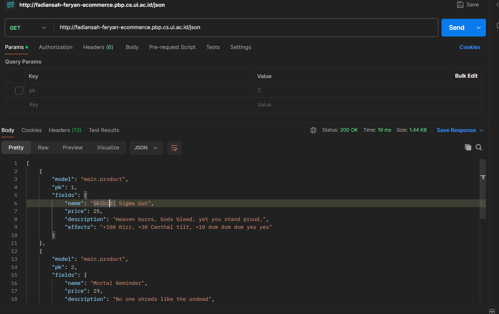
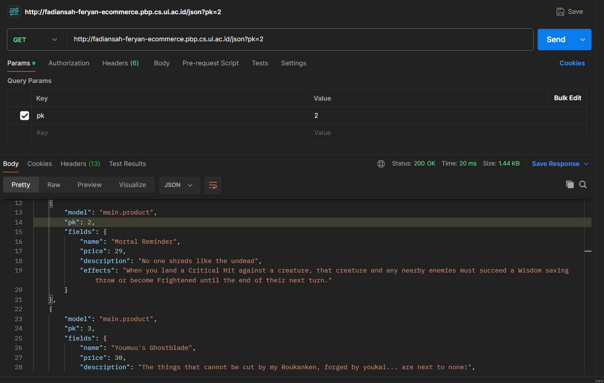
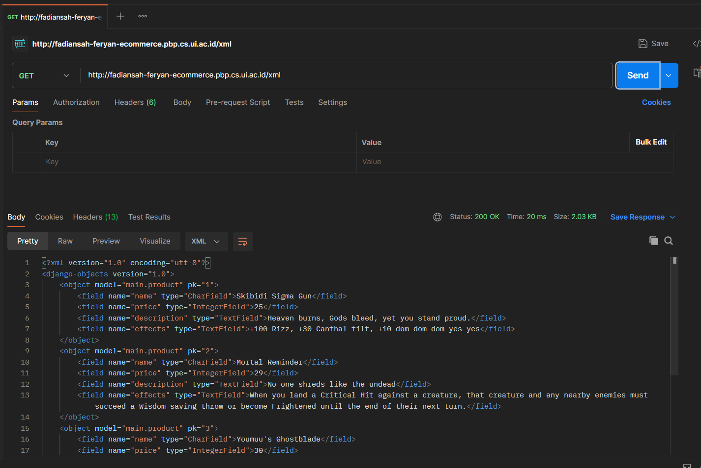
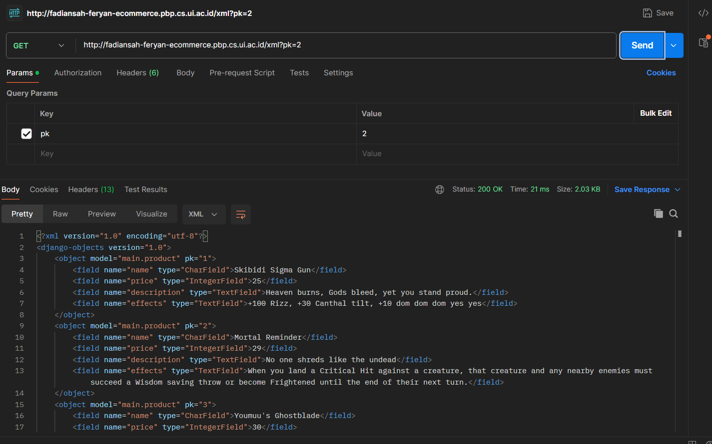

# Link deployment :
 http://fadiansah-feryan-ecommerce.pbp.cs.ui.ac.id/

 <h1> Tugas 2 </h1> 

 

# Pertanyaan 1

### Jelaskan bagaimana cara kamu mengimplementasikan checklist di atas secara step-by-step (bukan hanya sekadar mengikuti tutorial).

Saya pertama menginitialize git repo (tetapi belum disambung dengan repo di github), lalu membuat virtual environment dan menginisialisasi Django project. Saya lalu memenuhi syarat tugas 2 pada bagian - bagian yang berbeda.

# Pertanyaan 2

Buatlah bagan yang berisi request client ke web aplikasi berbasis Django beserta responnya dan jelaskan pada bagan tersebut kaitan antara urls.py, views.py, models.py, dan berkas html

[Bagan](./images/pbpbagan.png)

# Pertanyaan 3

### Jelaskan fungsi git dalam pengembangan perangkat lunak!

Git digunakan untuk melakukan version control dan melihat apa saja yang ditambahkan pada proyek pada timestamp tertentu. Git juga bisa digunakan untuk melakukan rollback ke versi sebelumnya jika ada masalah pada prod.

# Pertanyaan 4

### Menurut Anda, dari semua framework yang ada, mengapa framework Django dijadikan permulaan pembelajaran pengembangan perangkat lunak?

Karena Django pas untuk projek kecil dan memiliki paradigma yang cukup mudah untuk dimengerti.

# Pertanyaan 5

### Mengapa model pada Django disebut sebagai ORM?

Karena model pada Django berfungsi sebagai basis data untuk apa yang akan ditunjukkan kepada end-user dengan template.

 <h1> Tugas 3 </h1> 

 

# Pertanyaan 1

### Jelaskan mengapa kita memerlukan data delivery dalam pengimplementasian sebuah platform?

_Data delivery_ sangat penting dalam implementasi platform untuk memastikan transfer informasi yang akurat dan tepat waktu antara _user_, sistem, dan _service_. Pengiriman data yang efisien juga membuat _user experience_ yang baik dengan memastikan keandalan platform. Tanpa mekanisme pengiriman data yang tepat, fungsi platform bisa terganggu, yang dapat menyebabkan disatisfaksi _user_.

# Pertanyaan 2

### Menurutmu, mana yang lebih baik antara XML dan JSON? Mengapa JSON lebih populer dibandingkan XML?

Saya pribadi lebih menyukai JSON karena dalam pandangan sekilas struktur data dapat dicerna dengan jelas. Saya rasa hal ini juga berpengaruh atas popularitasnya dibanding dengan XML.

# Pertanyaan 3

### Jelaskan fungsi dari method `is_valid()` pada form Django dan mengapa kita membutuhkan method tersebut?

method `is_valid()` dalam form Django digunakan untuk memastikan data dalam field form dapat diterima oleh model yang sudah di deklarasikan. method `is_valid()` diperlukan supaya saat data diberikan ke database tidak ada error yang terjadi.

# Pertanyaan 4

### Mengapa kita membutuhkan `csrf_token` saat membuat form di Django? Apa yang dapat terjadi jika kita tidak menambahkan `csrf_token` pada form Django? Bagaimana hal tersebut dapat dimanfaatkan oleh penyerang?

`csrf_token` pada django digunakan untuk memastikan bahwa semua request pengubahan data datang dari `user` yang benar. Jika tidak menggunakan `csrf_token` pada form, penyerang dapat memberi request yang tidak divalidasi, tetapi diterima sebagai request valid oleh server dan melakukan request tersebut.

# Pertanyaan 5

### Jelaskan bagaimana cara kamu mengimplementasikan checklist di atas secara step-by-step (bukan hanya sekadar mengikuti tutorial).

Pertama, saya membuat file `forms.py` pada `/main` yang berisi bagaimana forms akan terbuat. Kedua, saya membuat 5 fungsi berbeda, yaitu `create_product()`, `show_xml()`, `show_json()`, `show_xml_by_id()`, dan `show_json_by_id`. Ketiga, saya membuat routing pada `main/urls.py` untuk membuat sistem data delivery dapat diakses. Keempat, saya membuat `create_product_entry.html` dan mengubah `main.html` untuk dapat menampilkan form pada website. Kelima, saya mengubah argumen `DIRS` pada `settings.py` menjadi `'DIRS': [BASE_DIR / 'e_commerce/templates']` untuk menunjukkan Django ke template yang benar. Terakhir, saya mengeksekusi migrasi supaya Django mengimplementasi model yang saya buat.

# Postman

### JSON

### JSON by ID

### XML

### XML by ID

<h1>Tugas 4</h1>

 

# Pertanyaan 1

### Apa perbedaan antara `HttpResponseRedirect()` dan `redirect()`

`Redirect()` adalah wrapper untuk class `HttpResponseRedirect` sedangkan `HttpResponseRedirect` merupakan class yang berisi informasi yang diperlukan untuk mengarahkan request ke arah yang telah ditetapkan.

# Pertanyaan 2

### Jelaskan cara kerja penghubungan model `Product` dengan `User`!

`Product` bisa disambungkan dengan `User` dengan menggunakan key yang sesuai. Key memiliki _identifier_ yang digunakan oleh ORM Django untuk mengidentifikasikan relasi dari sebuah `Product` dengan `User`. Dengan ini, request melewati Django dan memberikan response dimana `User` memiliki `Product`

# Pertanyaan 3

### Apa perbedaan antara _authentication_ dan _authorization_, apakah yang dilakukan saat pengguna login? Jelaskan bagaimana Django mengimplementasikan kedua konsep tersebut.

_Authentication_ adalah proses dimana sistem memeriksa apakah request login yang masuk merupakan `User` yang benar atau bukan. _Authorization_ adalah proses verifikasi hak yang dimiliki oleh `User`. 

Django melakukan _Authentication_ dengan langkah - langkah verifikasi yang ditetapkan dalam model seperti `username` dan `password`. Setelah menerima request login, Django memanggil `authenticate()` untuk mengecek validitas info login. Jika valid, objek `User` akan direturn. Jika salah, Django akan memberi return `none`.

Hak yang dimiliki `User` biasanya ditetapkan pada model juga, contohnya seperti _tag_ `is_superuser` atau `is_staff` dari built-in Django. Django juga bisa menetapkan hak `User` dengan dekorator seperti `@login_required` untuk mengharuskan _session_ tersebut sudah login ke sebuah `User` terlebih dahulu.

# Pertanyaan 4

### Bagaimana Django mengingat pengguna yang telah login? Jelaskan kegunaan lain dari cookies dan apakah semua cookies aman digunakan?

Django mengingat pengguna yang login menggunakan `session` dan `cookie`.

Saat `User` login, Django membuat `session` di server untuk menyimpan informasi identifikasi `User`. Setiap sesi diberi ID sesi unik, yang disimpan sebagai `cookie` di perangkat `User`.

Cookie adalah potongan kecil data yang dikirim oleh server dan disimpan di perangkat `User`. Cookie juga menyimpan ID `session` dalam `cookie` yang disebut sessionid.

Django menetapkan ID sesi ini di perangkat `User`, yang memungkinkan server untuk mengaitkan permintaan berikutnya dengan `User` yang sudah diautentikasi.

# Pertanyaan 5

### Jelaskan bagaimana cara kamu mengimplementasikan checklist di atas secara step-by-step (bukan hanya sekadar mengikuti tutorial).

aa

